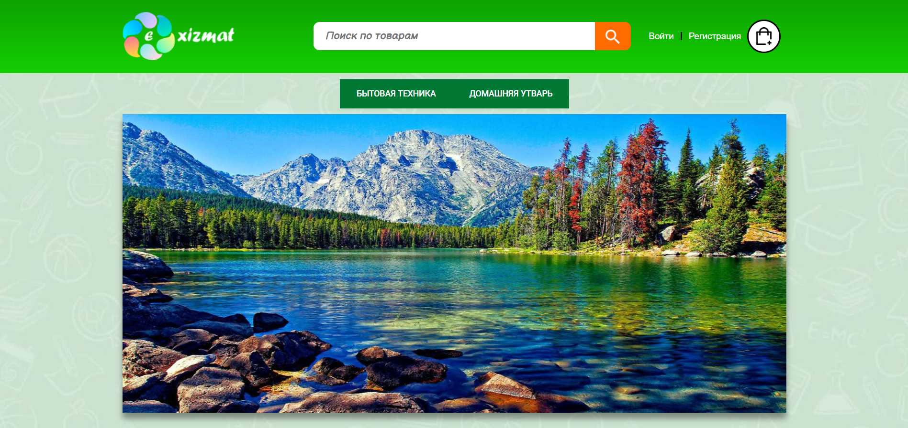

# Exizmat

Данный интернет магазин сделан при помощи Django



## О проекте

Магазин выполненный на django версии 2.1, python 3.9. С bootstrap, CSS, HTML5, JavaScript для фронта и PostgreSQL.
Магазин имеет такой функционал:
- Список всех продуктов;
- Список категорий;
- Собавление изображений к продукту;
- Возможность добавлять и удалять из корзины;
- Оформлять заказ через корзину, тем самым добавляя его в БД;
- Авторизация пользователей;


## Бэкенд разработчик

* **Муслитдинов Улугбек**

## Фронтенд разработчик

* **Тимур Касимов**


## License
*Этот проект находится под лицензией MIT [LICENSE](https://github.com/UlugbekMuslitdinov/exizmat/blob/main/LICENSE) и защищен торговой маркой Exizmat. Распространение и использование в коммерческих и/или личных целях без согласия автора ЗАПРЕЩЕНО*

## Установка:
### С помощью Docker:
```docker-compose up -d --build```

### С помощью Pipenv:
* ```pipenv install django psycopg2-binary```
* ```pipenv shell```
* ```python manage.py runserver```

